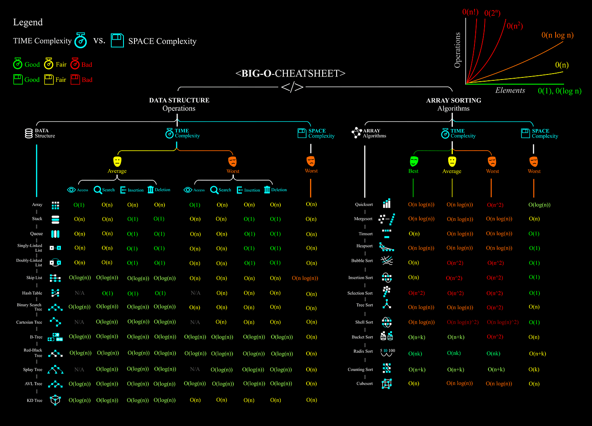

# Java sorting algorithms

*Java console application that solves a **sorting problem** which is defined as a total number of item to be sorted.*

| Branch |                                                                                               Pipeline                                                                                               |                                                                                            Code coverage                                                                                             |                                 Jacoco test report                                  |                                 SonarCloud                                 |
|:------:|:----------------------------------------------------------------------------------------------------------------------------------------------------------------------------------------------------:|:----------------------------------------------------------------------------------------------------------------------------------------------------------------------------------------------------:|:-----------------------------------------------------------------------------------:|:--------------------------------------------------------------------------:|
| master | [](https://gitlab.com/ShowMeYourCodeYouTube/java-sorting-algorithms/-/commits/master) | [](https://gitlab.com/ShowMeYourCodeYouTube/java-sorting-algorithms/-/commits/master) | [link](https://showmeyourcodeyoutube.gitlab.io/java-sorting-algorithms/test-report) | [link](https://sonarcloud.io/organizations/showmeyourcodeyoutube/projects) |

---

- Code coverage badge on Gitlab using Maven and JaCoCo plugin | Java | JVM (YouTube video)
  - <https://www.youtube.com/watch?v=nrs-DjTRwkk>
- All algorithms' details and the benchmark explanation
  - [ALGORITHMS](./ALGORITHMS.md)
- Sorting algorithms exercises found on the Internet
  - [EXERCISES](./EXERCISES.md)

## Technology stack

- Java (AWS Corretto)
- Maven
- Lombok
- JUnit
- Mockito
- LogCaptor

## Getting started

1. Enable annotation processing in your IDE (required by Lombok)
2. Import this repository as Maven project.
3. Run application using a main class:

```
SortingAlgorithmsAppLauncher
```

## Algorithms benchmark


>An algorithm is a set of instructions designed to perform a specific task.
Sometimes an algorithm might produce a different output when given the same input.
This relates to the area of deterministic and non-deterministic algorithms.
Sorting algorithms are deterministic.

> Benchmarking is the process of evaluating the performance of algorithms by measuring their execution time, memory usage, or other relevant metrics. It involves running algorithms on standardized datasets or tasks to obtain quantitative measurements that can be used for comparison. The goal of benchmarking is to provide an objective assessment of algorithm performance and identify potential areas for improvement.

> Benchmarking allows us to compare the performance of different algorithms on specific tasks or datasets, 
enabling us to make informed decisions about which algorithm to use in a given context.

Ref: https://saturncloud.io/blog/is-the-benchmarking-of-my-algorithms-right/

| Algorithm  | 50000&#160;elements&#160;(ns)   | 100000&#160;elements&#160;(ns)    | 150000&#160;elements&#160;(ns)    | Best&#160;complexity   | Average&#160;complexity   | Worst&#160;complexity   | Space&#160;complexity&#160;(the&#160;worst)   | Stable   | In&#160;place  |
|:--------------------------------|:----------------:|:-----------------:|:-----------------:|:-----------------:|:--------------------:|:------------------:|:------------------------------:|:--------:|:---------:|
| Bubble&#160;sort |  4928230700  | 20074524300 |  37438477400 |  O(n)  |  O(n^2)  |  O(n^2) |  O(1) |   yes  |  yes  |
| Cocktail&#160;Shaker&#160;sort <br/> (Bidirectional&#160;bubble&#160;sort)   |  1622600  | 1603300 |  1278200 |  O(n)  |  O(n^2)  |  O(n^2) |  O(1) |   yes  |  yes  |
| Selection&#160;sort |  469744400  | 1834796800 |  4116949900 |  O(n^2)  |  O(n^2)  |  O(n^2) |  O(1) |   no  |  yes  |
| Insertion&#160;sort   |  1595300  | 1352000 |  208500 |  O(n)  |  O(n^2)  |  O(n^2) |  O(1) |   yes  |  yes  |
| Shell&#160;sort |  6446800  | 2566500 |  1116300 |  O(n log n)  |  depends on gap sequence  |  O(n^2) |  O(1) |   no  |  yes  |
| Counting&#160;sort |  16629700  | 6919800 |  7940500 |  O(n+k)  |  O(n+k)  |  O(n+k) |  O(n+k) |   yes/no*  |  no/yes*  |
| Heap&#160;sort |  11219900  | 33287900 |  16133000 |  O(n log n)  |  O(n log n)  |  O(n log n) |  O(1) |   no  |  yes  |
| Merge&#160;sort |  11539000  | 8662800 |  18594200 |  O(n log n)  |  O(n log n)  |  O(n log n) |  O(n) |   yes  |  no  |
| Quick&#160;sort |  4743300  | 2344100 |  3392600 |  O(n log n)  |  O(n log n)  |  O(n^2) |  O(log n) |   no  |  yes  |

*ns - nanoseconds, B - bytes, n - number of elements in an array, k - the dataset/array elements range*  
*The table is auto generated using the app. Choose `10` to generate new results and copy the table from `resources`.*

**Remarks**  
*The counting sort can be implemented as:
- not in-place: stable, O(N) space complexity,
- in-place: none stable, O(1) space complexity.

Table generated using: https://www.tablesgenerator.com/markdown_tables#  
Big O Notation reference: https://www.bigocheatsheet.com/



## Release a new version

Run Maven commands using Maven Release plugin.
```text
mvn release:prepare
```
